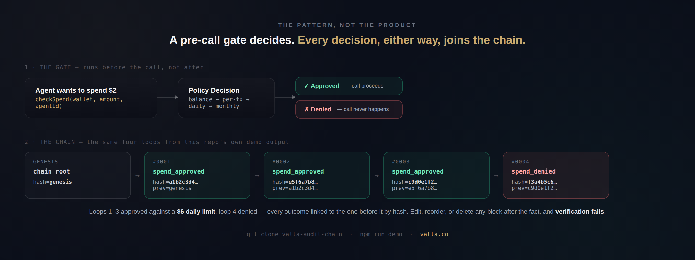

# valta-audit-chain

[](https://github.com/Billionaire664/valta-audit-chain/actions/workflows/ci.yml)
[](./LICENSE)

A reference implementation of two patterns used in [Valta](https://valta.co)'s spend gate:

1. **A pre-call spend gate** — an authorization check that runs *before* an agent's LLM/tool call fires, not a monitor that inspects it after the fact.
2. **A hash-chained, tamper-evident audit log** — every decision the gate makes (approved or denied) is written to an append-only log where each entry is cryptographically linked to the one before it.

The agent asks permission, the gate decides, and the decision is provably recorded — whichever way it went.



This is not a library to install. It's a small, readable reference — read the source, adapt what's useful, discard what isn't. Postgres + TypeScript here; both patterns are language- and database-agnostic. Known limitations are documented explicitly below, not hidden.

## Quickstart

```bash
git clone https://github.com/Billionaire664/valta-audit-chain.git
cd valta-audit-chain
npm install
npm run demo
```

Simulates a rogue agent trying to spend $2, four times, against a wallet with a $6 daily limit. Loops 1–3 are approved, loop 4 is denied — every decision is written to the hash chain and the chain is verified at the end.

```
Rogue agent loop — $2/call against a $6 daily limit

[loop 1] APPROVED — $2 spent
[loop 2] APPROVED — $2 spent
[loop 3] APPROVED — $2 spent
[loop 4] DENIED — Daily limit of $6 would be exceeded (spent today: $6.00)
VALTA SPEND GATE · EXECUTION HALTED

Audit chain for wallet_demo:
#0001 spend_approved hash=a1b2c3d4… prev=genesis
#0002 spend_approved hash=e5f6a7b8… prev=a1b2c3d4…
#0003 spend_approved hash=c9d0e1f2… prev=e5f6a7b8…
#0004 spend_denied   hash=f3a4b5c6… prev=c9d0e1f2…

Chain verification: VALID
```

## Why a pre-call gate, not reactive detection

Reactive loop/cost detection (pattern-matching repeated calls, checking a bill after the fact) catches problems after money is already spent. A pre-call gate catches the first call that shouldn't happen, not just the Nth repeated one.

Most audit logs are timestamped rows — anyone with database write access can edit history after the fact. For systems making autonomous decisions (spend gates, loop guardrails, policy engines), that's not sufficient. The log itself needs to prove it wasn't tampered with, independent of who has database access.

## Core architecture

### The spend gate

See [`src/spend-gate.ts`](./src/spend-gate.ts).

```
Agent wants to spend $X
        │
        ▼
 checkSpend(wallet, amount, agentId)
        │
   approved? ──no──► denied, with a structured reason + code
        │
       yes
        │
        ▼
 agent's call proceeds
```

Checks run cheapest-and-most-decisive first: balance → per-transaction limit → daily limit (requires a spend-history lookup) → monthly limit. A denial short-circuits before hitting the ledger when possible.

```ts
import { checkSpend } from "./src/spend-gate";

const decision = await checkSpend(ledger, {
  wallet: { walletId: "wallet_abc", balance: 100, dailyLimit: 6, monthlyLimit: 0, perTxLimit: 0 },
  amount: 2,
  agentId: "rogue_agent",
});

// { approved: false, code: "daily_limit_exceeded", reason: "Daily limit of $6 would be exceeded (spent today: $6.00)" }
```

### Hashing primitive & wire specification

See [`src/audit-chain.ts`](./src/audit-chain.ts).

Each entry's hash is computed as a deterministic SHA-256 over a pipe-delimited interpolation of the entry's own fields plus the previous entry's hash:

$$H_n = \text{SHA256}(H_{n-1} \parallel \text{scopeID} \parallel \text{agentID} \parallel \text{eventType} \parallel \text{action} \parallel \text{timestamp})$$

Where $H_0 \equiv \text{"genesis"}$ — a literal initializer string, not `null`, so "is this the first block" reduces to a plain string comparison rather than a null-check special case scattered through the codebase — and `timestamp` is locked at write time as a unix-millisecond scalar. Verification recomputes the hash from the stored fields, so the exact same timestamp value must be used both to compute the hash and to populate `created_at` on the row, not independently regenerated at read time (this exact bug — recomputing against a fresh timestamp instead of the persisted one — was caught and fixed during development; see `src/audit-chain.ts` and `src/verify.ts`).

Field names in the formula above are written camelCase (`scopeID`, not `scope_id`) purely to render cleanly through GitHub's math renderer, which chokes on underscores inside `\text{}` blocks even when escaped. In the actual code and schema, the fields are `scope_id`, `agent_id`, `event_type` (see `schema.sql`) — the formula and the implementation refer to the same fields, just with cosmetic naming differences for renderer compatibility.

```
entry[0].hash = SHA256("genesis" | payload[0])
entry[1].hash = SHA256(entry[0].hash | payload[1])
entry[2].hash = SHA256(entry[1].hash | payload[2])
...
```

Verification (see [`src/verify.ts`](./src/verify.ts)) walks the chain in order and confirms two independent things for every entry `i`:
1. `entry[i].previousEntryHash === entry[i-1].entryHash` — the chain links are intact
2. `entry[i].entryHash === recompute(entry[i])` — the entry itself wasn't edited after being written

Either check failing means the sequence was reordered, an entry was deleted, or a field was edited post-write.

#### Schema

See [`schema.sql`](./schema.sql). Key fields:
- `event_type` — what happened (`spend_approved`, `spend_denied`, `policy_blocked`, ...)
- `affected_resource_id` — the scope the check ran against (wallet, budget, authority — whatever your domain calls it)
- `reasoning` — structured, machine-readable reason the decision was made
- `previous_entry_hash` / `entry_hash` — the chain

Deliberately excluded from the hash input: the row's own auto-incrementing `id`. Chaining on a sequential primary key would break the chain on any operation that changes ID assignment (a restore from backup, a replication failover, a migration that re-sequences rows) even when the actual event history is unchanged. The chain should reflect what happened, not the database's internal bookkeeping of how it was stored.

## Known limitation: concurrent calls and the check-then-write gap

**This reference does not implement concurrency control.** `checkSpend` reads the current spend total, decides, and returns — there is no row lock, no transaction isolation, and no atomic check-and-reserve step. If two concurrent calls for the same wallet both read the ledger before either one writes, both can be approved even if their combined total would exceed the limit. This is a textbook check-then-act race condition (TOCTOU), and it is present in this code as written.

This is disclosed here rather than glossed over because a security-adjacent reference that hides its own race conditions is worse than one that names them. If you're adapting this for a system with real concurrent load (e.g., many sub-agents spending from one wallet simultaneously), you need one of:

- **A row lock on the read** (`SELECT ... FOR UPDATE` in Postgres) so concurrent checks against the same wallet serialize instead of racing.
- **An atomic conditional update** — instead of "read total, compare, then insert," use a single statement that both checks and reserves atomically (e.g., `UPDATE wallets SET balance = balance - $amount WHERE balance >= $amount RETURNING balance`, checking whether a row was returned).
- **Optimistic concurrency** — a version column on the wallet row, incremented on every write, with the write conditioned on the version read at check-time; retry on conflict.

None of these are implemented here. This repo demonstrates the authorization and audit *pattern*; the concurrency guarantees are a property of how you wire it into your actual storage layer, and they matter a lot more at 1 wallet with 50 concurrent sub-agents than at 1 wallet with 1 agent calling sequentially.

### Threat model boundary

What this pattern does and doesn't protect against, stated plainly:

| Vector | Mitigation | Status |
| :--- | :--- | :--- |
| **Spend exceeding a set budget** (per-tx, daily, monthly limit) | Gate check runs before the call; denial short-circuits before execution | **Enforced** |
| **Post-hoc tampering of the audit trail** (editing/reordering/deleting a written entry) | Breaks the `entry_hash` ↔ `previous_entry_hash` linkage on verification | **Detected** (not prevented — see "tamper-evidence, not tamper-prevention" above) |
| **Concurrent double-spend** (multiple simultaneous calls exceeding a shared limit) | None in this reference — see the limitation above | **Out of scope** (needs DB-level locking) |
| **An adversary with full DB write access rewriting the whole chain, hashes included** | None — if they control the hash function's inputs, they can regenerate a self-consistent fake chain | **Out of scope** (needs IAM/access control at the database layer, not this pattern) |

Notably absent from this table: **loop/repetition detection.** This pattern enforces a spend ceiling — it has no concept of "the same action repeated." An agent looping indefinitely while staying under budget passes through undetected; catching that pattern is a different, complementary problem (see the discussion in [CrewAI #6414](https://github.com/crewAIInc/crewAI/issues/6414) on trajectory-hash-based loop guardrails, which this pairs with rather than replaces).

## Suggested integration points

This is not a plugin for any specific framework — there's no shipped LangChain callback, CrewAI decorator, or Vercel AI SDK middleware in this repo. The diagram and table below describe *where* a gate like this would sit if you're wiring it into one of these stacks yourself, not a list of what's included.

```
[Agent Framework Execution] ──► (sync checkSpend call) ──► [Spend Gate]
                                                                 │
                          ┌──────────────────────────────────────┴─────┐
                          ▼ approved                                   ▼ denied
              [write spend_approved entry]                  [write spend_denied entry]
                          │                                            │
                          ▼                                            ▼
             [proceed — call model/tool provider]             [halt — call never happens]
```

Both branches write to the audit chain; only the approved branch results in the actual model/tool call happening. The check is synchronous and blocking by design — an async or fire-and-forget gate can't stop a call that's already in flight.

| Framework | Where a gate would sit | Rough integration shape |
| :--- | :--- | :--- |
| **LangChain** | Before the LLM/tool call reaches the provider | A custom callback (e.g. hooking `on_llm_start` / a tool wrapper) that calls `checkSpend` before returning control to the chain |
| **CrewAI** | Tool execution boundary | Wrap the tool function itself so the gate runs before the tool's actual logic executes |
| **Raw OpenAI SDK** | HTTP client layer | An interceptor on the client's request path (e.g. overriding `baseURL` to route through a small proxy that gates first) |
| **Vercel AI SDK** | Around `generateText` / `streamText` | Call the gate before invoking the SDK function; on denial, short-circuit and never call the SDK at all |

In every case, the shape is the same: the gate check happens synchronously, before the network call to the model/tool provider, and the call simply doesn't happen if the gate denies it.

## Performance

Measured on the in-memory reference implementation (`src/memory-store.ts`), 10,000 iterations, warm JIT:

| Operation | Measured (avg) |
| :--- | :--- |
| `checkSpend` (no daily/monthly history lookup needed) | ~0.001–0.002ms |
| `writeAuditEntry` (SHA-256 hash computation + insert) | ~0.05–0.07ms |
| Combined gate check + audit write | ~0.06ms |

This isolates the compute cost of the gate and hashing logic itself — SHA-256 hashing dominates the cost, and it's still sub-millisecond. It is **not** a claim about Postgres write latency in production, which depends on your database, network, connection pooling, and whether you've added the row-locking discussed above. Measure your own stack; don't take a number measured against an in-memory map as a production guarantee.

Reproduce: `npx tsx bench.ts` (not included in `npm run demo`; a separate script for exactly this purpose).

## Composed together

See [`src/example.ts`](./src/example.ts) — `guardedAgentSpend()` runs the gate, then writes the decision (approved or denied) to the chain before returning control to the caller. The agent never gets to execute a call that was denied; the denial is provable after the fact either way.

## Design notes from building this

1. **Chain per scope, not globally.** A single global chain serializes every write against the whole system. Chain per logical unit — per wallet, per agent run, per crew — so chains can be written independently and still be independently verified.

2. **Hash the meaningful fields, not incidental metadata.** Include enough of the payload that a re-ordering or field edit changes the hash, but don't include volatile fields (like auto-incrementing IDs) that have no bearing on what actually happened.

3. **This is tamper-evidence, not tamper-prevention.** Anyone with raw database access can rewrite an entire chain from scratch if they also control the hashing function. This protects against accidental mutation and partial edits, and gives you a verifiable trail to point to — it is not a substitute for proper access control on the database itself.

## This repo vs. the hosted version

This repo is the pattern, stripped to its essentials — no database driver, no dashboard, no concurrency control, no multi-agent wallet management. Useful for learning the pattern, wiring it into your own stack, or porting it to a different language.

| | This repo (DIY) | [Valta](https://valta.co?ref=github) (hosted) |
|---|---|---|
| Spend gate | reference code, no concurrency control | live API, `POST /api/v1/spend`, row-locked |
| Hash-chained audit log | reference code | hosted, queryable, exportable (CSV/JSON) |
| Named agent wallets | build it yourself | per-agent wallets, daily/monthly/per-tx limits |
| Dashboard to view the chain | build it yourself | included |
| Kill switch / freeze agent | build it yourself | included |

[Valta →](https://valta.co?ref=github)

## License

MIT.
